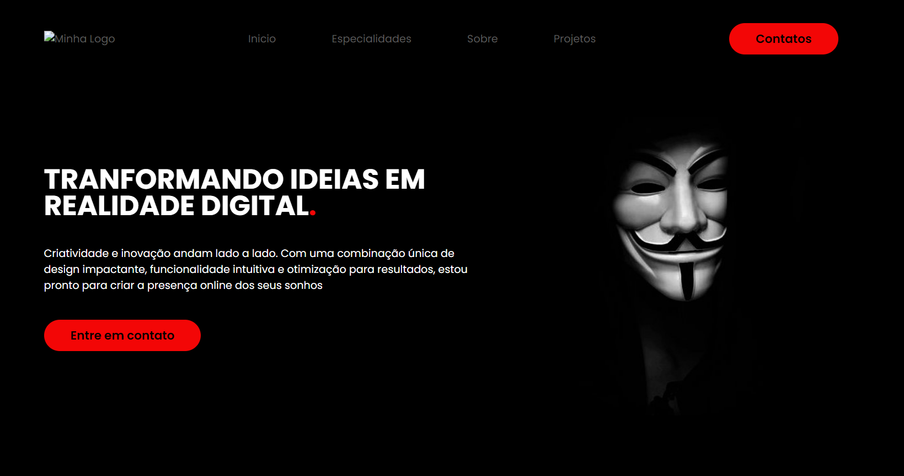

<h1 align="center">Portifólio - Thiago 💻</h1>

<h4 align="center"><a href="https://thigas0608.github.io/portifolio/">Confira o projeto aqui</a></h4>

## Sobre

Projeto feito no intuito de me apresentar, como desenvolvedor.

### O site é composto por:

- **Inicio:** ;
- **Especialidades:** ;
- **Sobre:** ;
- **Projetos:** ;
- **Contato:** ;
- **Redes:** .

## 🧠 Conceitos Aplicados

- Estrutura HTML válida.
- Importação de fontes externas.
- Uso de ícones.
- Semântica HTML com tags apropriadas.
- Links de navegação.
- Acessibilidade com atributos `alt`.
- Utilização de classes CSS para estilização.
- Responsividade com flexbox.
